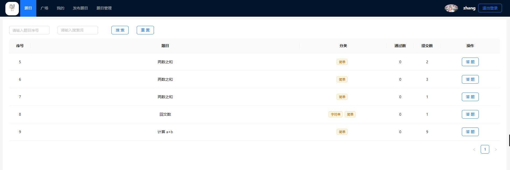
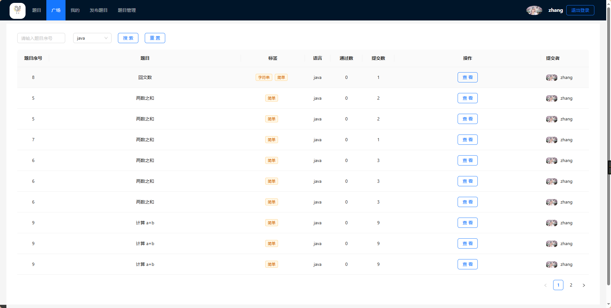
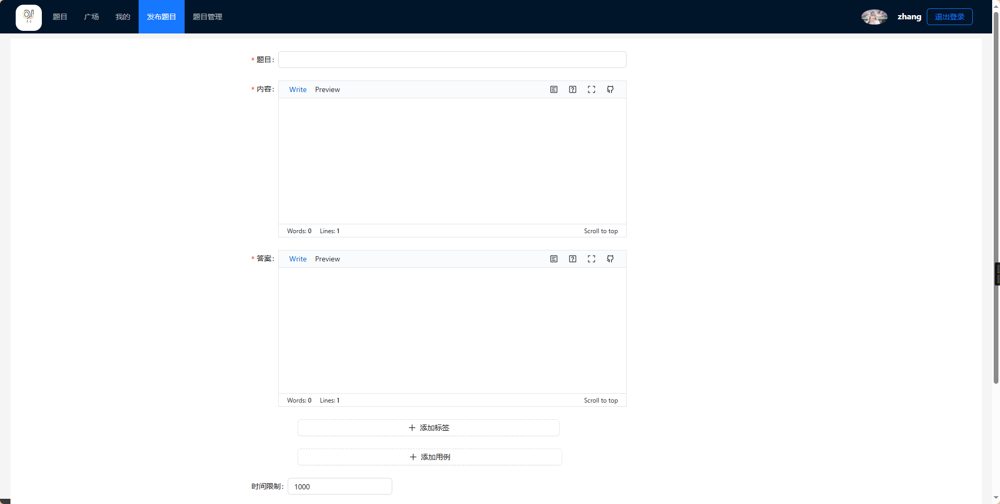
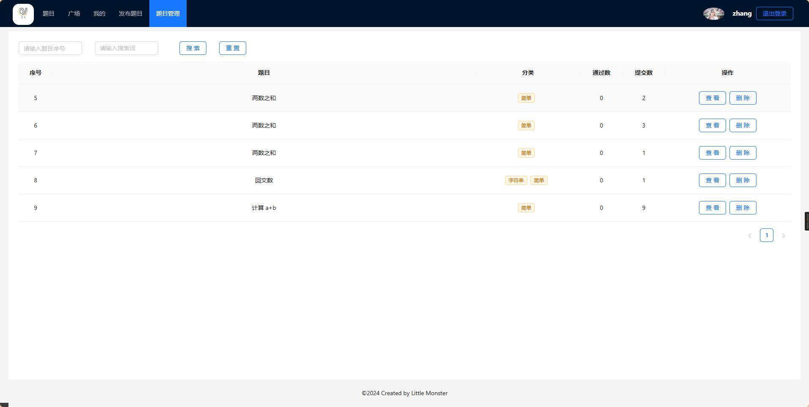
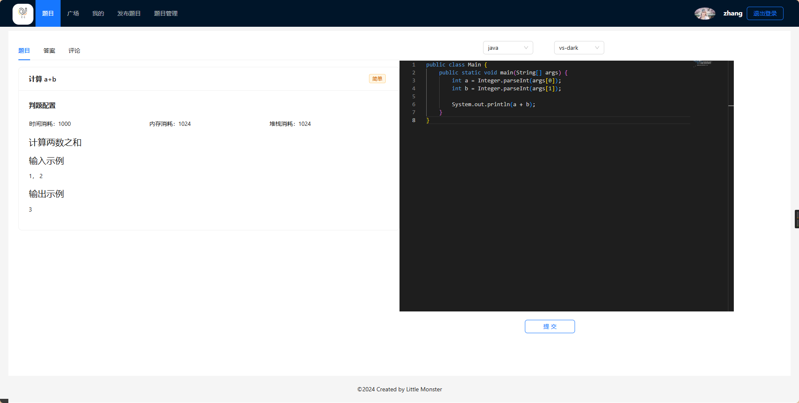

# Lingsi-OJ

## 项目简介

本项目旨在通过代码自己实现一个oj系统，学习在实现过程中的一些相关技术和知识。

## 项目技术栈

- 前端：Vue3 + Vite + Ant Design Vue + axios + bytemd + monaco-editor + vue-router + pinia
- 后端：Spring Boot + MyBatisPlus + MySQL + Redis + OpenFeign + lombok + HuTool

其中，前端：bytemd是一个开源的markdown编辑器，
monaco-editor是一个基于vscode的编辑器，pinia用于在全局存储用户状态信息。

后端：redis用于存储用户登录状态，OpenFeign用于调用远程的代码沙箱服务进行判题。

> 项目还是存在一定的学习价值的，比如：后端拆分为微服务；使用消息队列进行服务解耦；代码沙箱实现不同的语言的判题；前端实现代码编辑器等等。

## 项目预览

## 地址说明
前端项目地址：在本项目的front分支下

代码沙箱服务地址：在本项目的sandbox分支下

## 特别说明
由于本人重于后端，所以前端中还存在代码编辑器的使用问题（较懒，不想折腾了），以及一些其他问题，还请多多包涵。

本项目仅供学习交流使用，不得用于商业用途，如有侵权，请联系删除。
